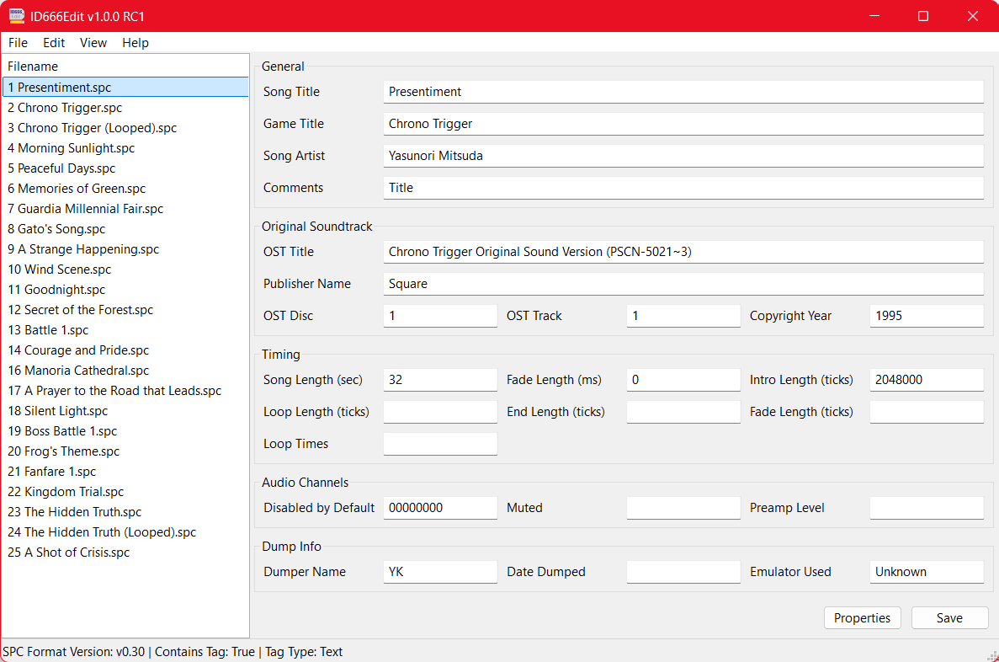

# ID666Edit
A cross-platform tag editor for SNES .spc music files.

## Overview

ID666Edit is a native, cross-platform, and open source program written in C++ 
for editing ID666 metadata tags in SNES .spc music files. It is available in 
both GUI and command-line flavors. It runs on Windows, macOS, and Linux with 
support for multiple CPU architectures. 

## Features

- Ability to edit all ID666 tag fields, including extended tag data
- Updates both extended and non-extended data fields according to the SPC file format specification
- Automatically adds, removes, or updates extended data fields depending on the size of the data entered into a field
- Can edit text, binary, or mixed format ID666 tags
- Can make bulk edits across multiple .spc files at once in both GUI and command line apps
- Compatible with a wide variety of .spc files, including early dumps
- Supports doing tag-to-filename and filename-to-tag conversions
- Supports incrementing OST track numbers
- Command line version supports printing, editing, and filtering on specific fields across multiple files at the same time.

## Downloading

You can download pre-compiled binaries for most major platforms and CPU 
architectures in the releases section. 

## Limitations

The program does not currently support editing .rsn or other archive files
directly. You must first extract the archive, edit the files, and re-archive
them. The .rsn formatted files are really .rar files that can be extracted
with archive utilities such as 7-zip.

## Compiling from Source

You can compile the programs from source by cloning this repo and building
the project with CMake. It should be able to compile on most platforms if
you have git, CMake, and an appropriate C++ compiler installed on your OS. 
Assuming you do, you can build the program using a few simple commands from
your command line shell of choice:

1. Clone the Repo:

`git clone https://github.com/stephenbonar/ID666Edit`

2. Navigate to the cloned repo:

`cd ID666Edit`

3. Clone the submodule dependencies:

`git submodule update --init --recursive`

3. Create the build directory

`mkdir build`

4. Navigate to the build directory

`cd build`

5. Configure CMake

`cmake ..`

6. Build the program

`cmake --build .`

There are also some Visual Studio Code profiles included for building and
debugging on macOS, Windows, and Linux. Assuming you have the official
C++ and CMake extensions installed in Visual Studio Code, you can also
use Code to build and debug the programs out of the box. 