# ID666Edit Getting Started Guide

## Preparing Soundtrack for Editing

Before you can begin editing the .spc files in a soundtrack, you must first
extract the .spc files from an achive if they are in typical archive formats
(.rsn files, .rar., .zip, etc.).

## Launching the Program

ID666Edit comes with two application binaries, a GUI and command-line version:

| Binary | Filename (Windows) | Filename (macOS) | Filename (Linux) | Purpose |
| - | - | - | - | - |
| GUI | ID666Edit.exe | ID666Edit.app | ID666Edit.AppImage | Launches the GUI version of the program
| Command Line | id666editc.exe | id666editc | id666editc | The command-line version of the program

Double click the GUI binary file to launch the graphical version of the program.
Run the command-line version of the program

## Editing Soundtracks with the GUI Version

### Opening .spc Files

Click File -> Open to open one or more .spc files. You can select more than one
file at a time for editing as the GUI version can edit files in bulk. 

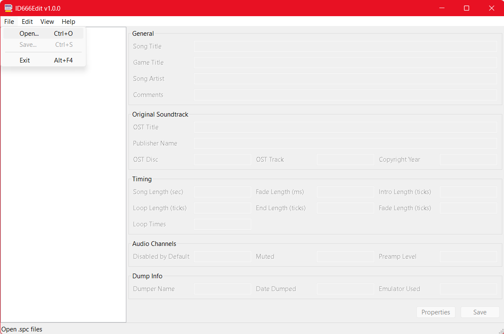

### Selecting One or More Files for Editing

When you open multiple files at the same time, the first file in the list will
be selected for editing and all of the text fields will be populated. To change
your selection to a different file, simply click which file you want to edit in
the left-hand pane.

### Changing Tag Values for a Single File

To change an individual tag value (for instance, OST Track) on the selected
song, simply change the value in the text field and click the Save button. 

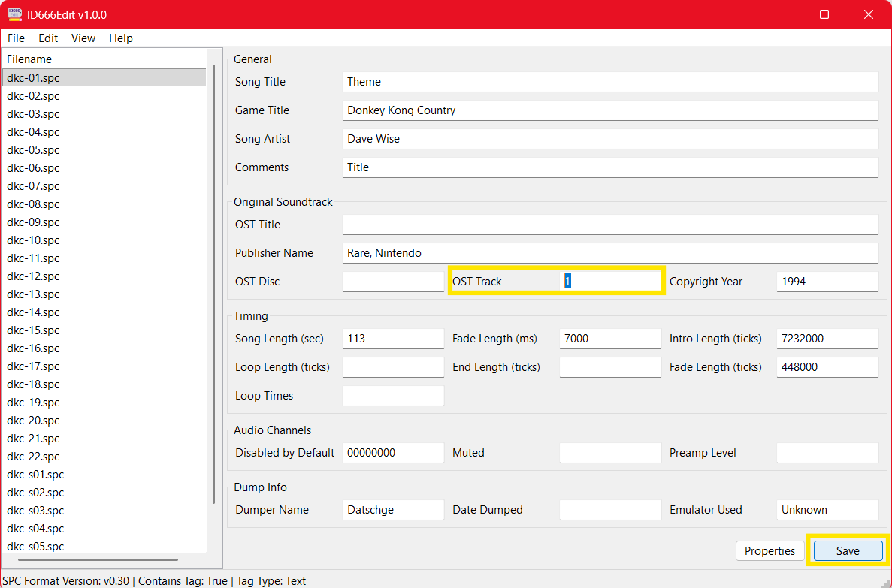

### Changing Tag Values for Multiple Files (Bulk Editing)

If you select multiple files, fields with common values will be populated with
the value that is shared across that tag field in all of the selected files
(example highlighted in green in the screenshot). Fields that differ between the
selected tracks will show 'multiple values' in the text field (example
highlighted in yellow in the screenshot). You can change either common values
or differing values to the same value by changing that text field and clicking
the Save button.

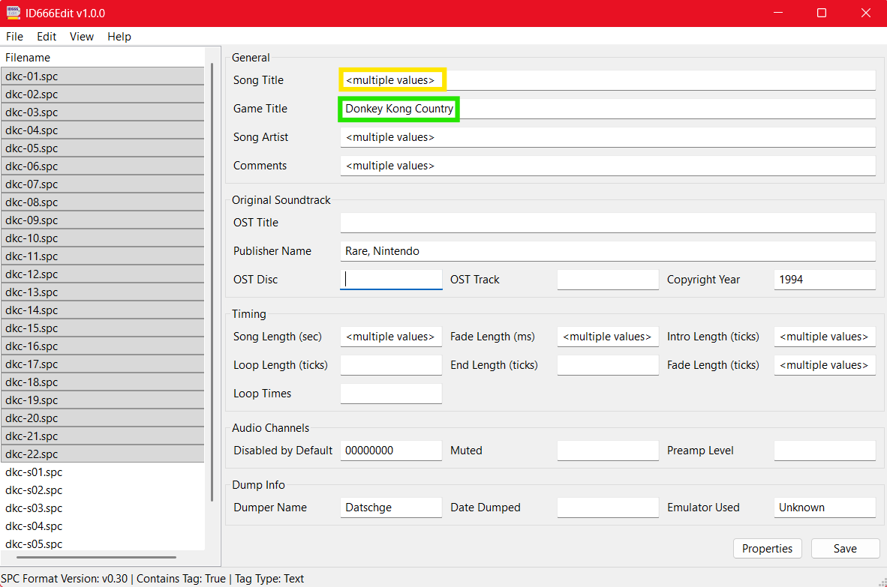

### Determining What a Field Is For

Hover over a particular field for a few seconds and a tool tip will pop up
describing what a particular tag field is for.

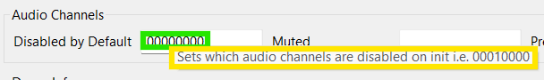

### Converting Filename to Tag

One useful feature is to use the filenames as a basis for updating the tags.
For instance, there are a number of .spc files out there that only have track
numbers in the filename but not in the OST track, presumably because OST track
is only populated if the game had an offical OST and indicates which OST track
number the .spc file corresponds to. However, some music players do not handle
the filename based track numbers well, so you can use this program to convert
the filename track number into an OST track number. 

Select the files you want to import information from the filenames into tag
values by clicking Edit -> Filename to Tag

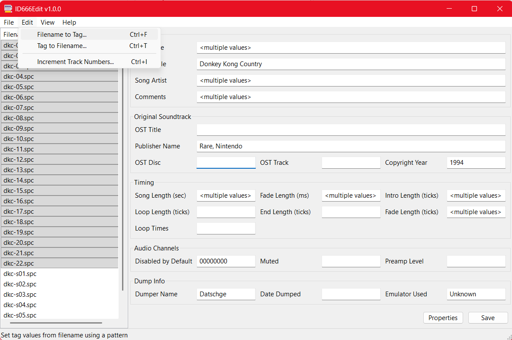

A dialog box will appear allowing you to specify a filename pattern to import
the tag values from. For the part of the filename that is the same across all
files, type it verbatim. For the part you wish to extract, such as the track
number that varies across each filename, use a placeholder like %track%. 
Supported placeholders are listed in the dialog box.

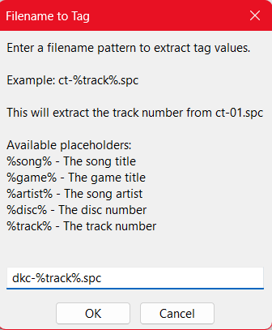

Once you have finished writing your pattern in the text field, click OK. 
Double check the track number has been successfully updated on each file by
clicking on them.

### Converting Tag to Filename

You can also convert tag values to new filenames. This creates a copy of the
original file with the new name on your system rather than a rename. You will
need to manually clean up the files if you don't want to keep the files with
the original names.

Select the files you want to convert the tag values to filenames with and click
Edit -> Tag to Filename.

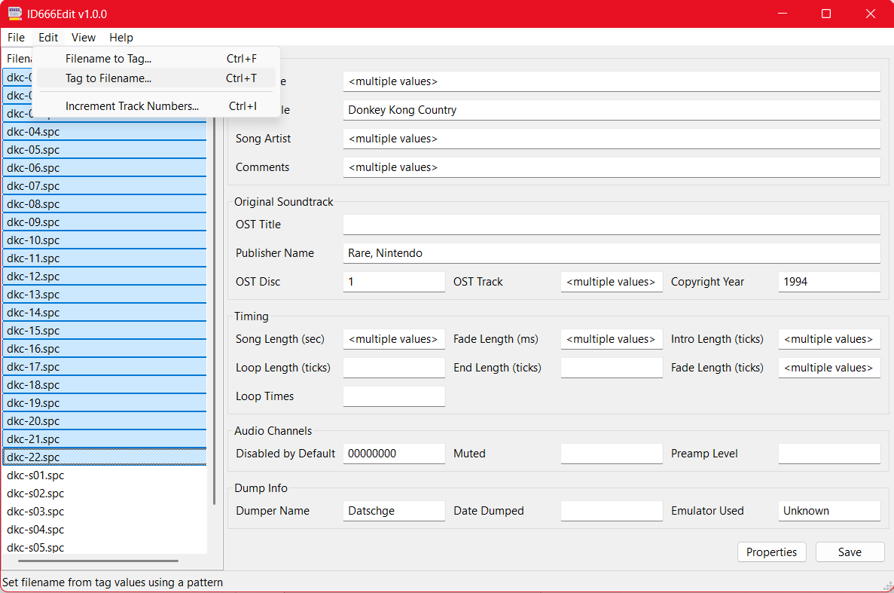

A dialog box will appear allowing you to specify a pattern to generate the new
filenames with. Any part of the filename you want to be the same across all
selected files, type verbatim. To substitute tag values in part of the filename,
such as including a track number, use placeholders such as %track%. A list of
supported placeholders is displayed in the dialog.

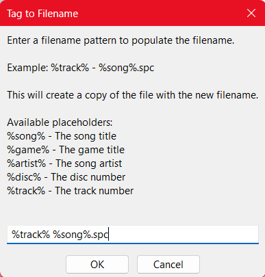

Once you have finished writing your pattern in the text field, click OK. 
Double check that copies of the files were successfully created on your system
with the new filenames. They should appear in the same folder as the original
files.

### Incrementing Track Numbers

When editing OST track numbers, you may find yourself in a situation where
you need to increment track numbers in bulk. This can happen when you're 
re-numbering tracks, etc. To do this, select the files you want to increment
the tracks for and click Edit -> Increment Track Numbers.

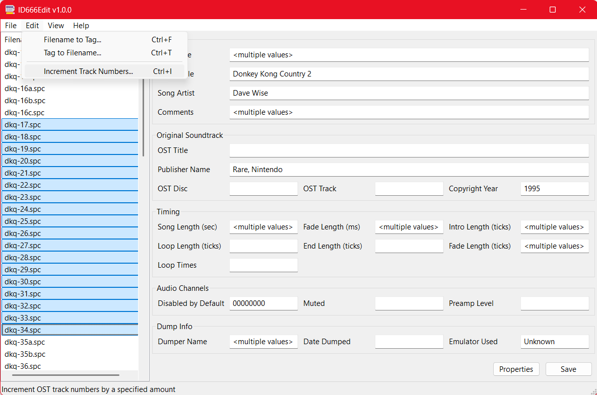

A dialog will appear allowing you to enter an amount to increment the track
numbers of the selected files by. For instance, if you enter '2', it will
increment each track number by adding 2 to it. Alternatively, you can enter
a negative number to decrement the track numbers. So, if you enter -2, it will
subtract 2 from each track number.

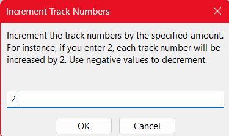

Once you click OK, the track numbers will be incremented. Double check that
they incremented to the correct amount.

### Editing Extended Tag Data

SPC files have tag data stored both in the file header, which is the location
for non-extended tag data, and in a RIFF chunk at the end of the file, which is
the location of the extended tag data.

This program automatically updates both the extended and non-extended tag
data according to the SPC file format specification. If the data can be
reasonably stored in the non-extended data, it is only stored in the 
non-extended area. If it needs to be stored in the extended area, it will be
stored there.

## Viewing Additional Properties

You can see additional information about .spc files by looking at the status
bar at the bottom of the main window when selecting a file, such as the
version of the .spc file, whether or not the header contains a tag, and what
format the tag is (text, binary, or mixed).

You can see even more information such as the SPC700 register values by clicking
the Properties button.

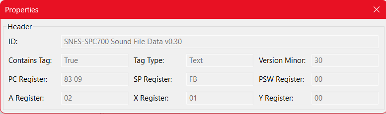

## Editing Soundtracks with the Command Line Version

Although the GUI version still supports bulk editing and offers most of the
same features, the command line version does support a few additional advanced
features like printing out specific fields across multiple files, bulk editing
at the command line, only printing or editing files that have tag values that
match specified values, etc. 

Detailed help and usage information can be displayed using the --help switch

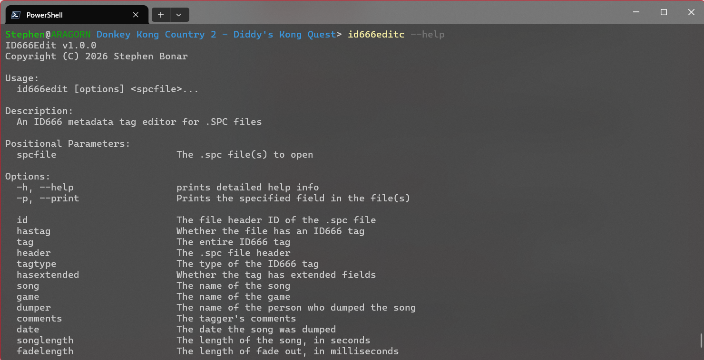

### Examples

#### Printing Basic Information

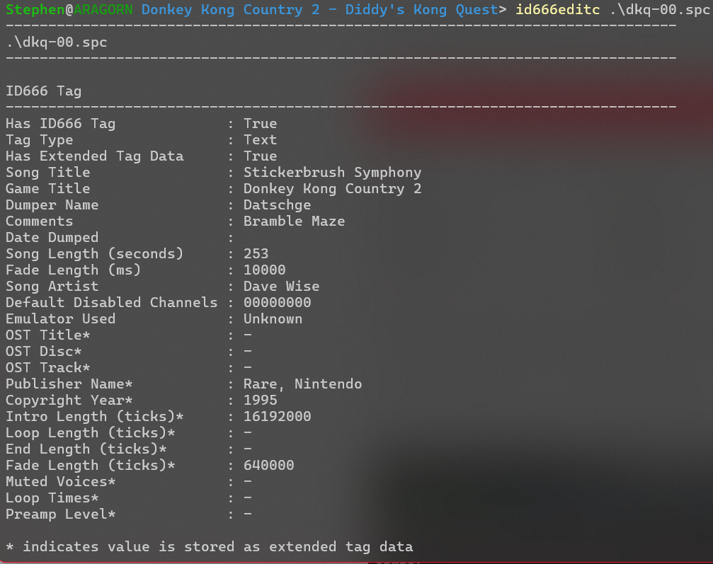

#### Printing Detailed Information

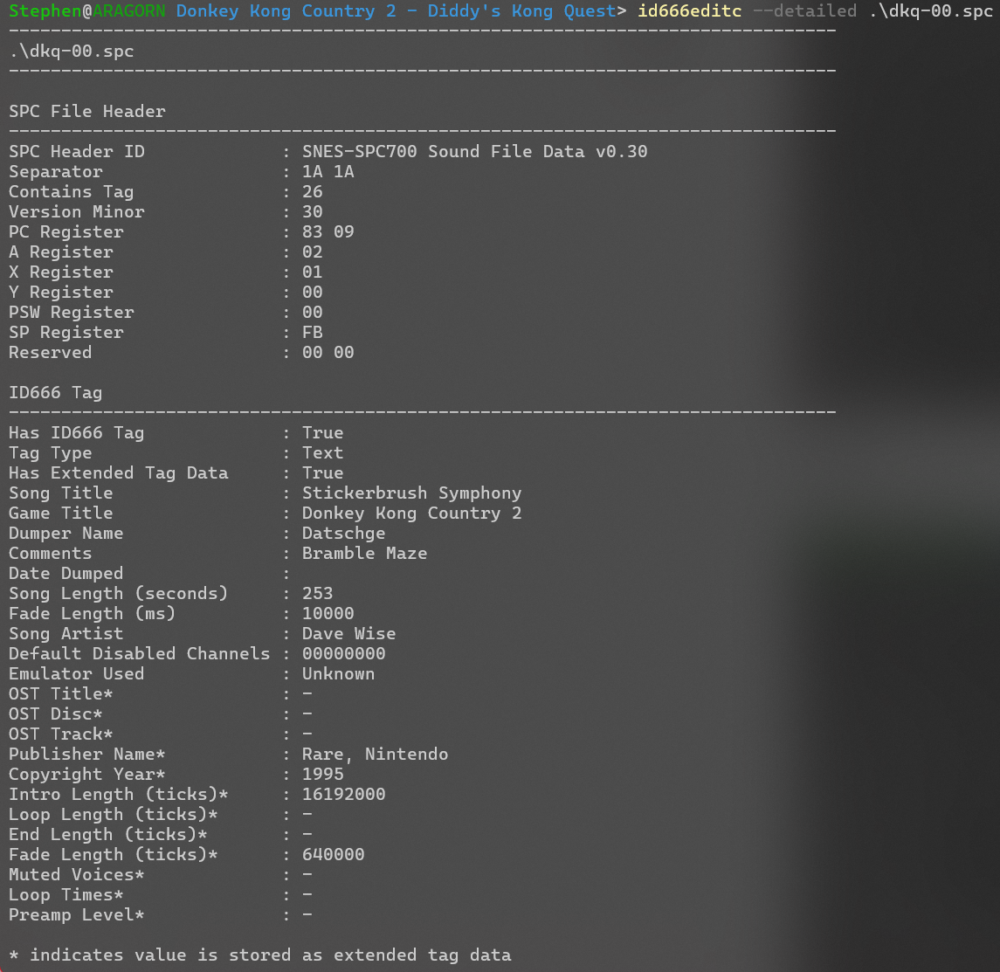

#### Printing Specific Fields

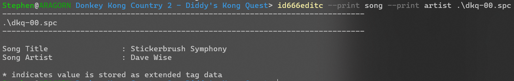

#### Editing Specific Fields

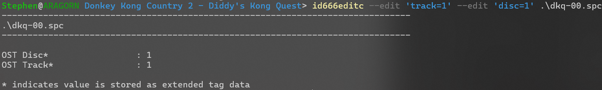

#### Filtering Songs by Tag Value

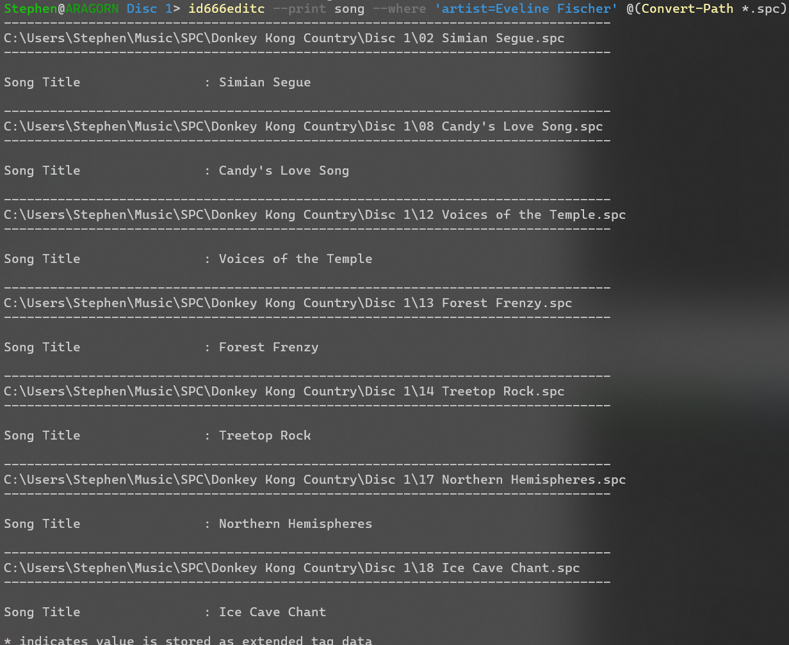

NOTE: in this example, @(Convert-Path *.spc) is used in lieu of globbing on
Linux or macOS since I took this screenshot in PowerShell, which does not
support globbing.